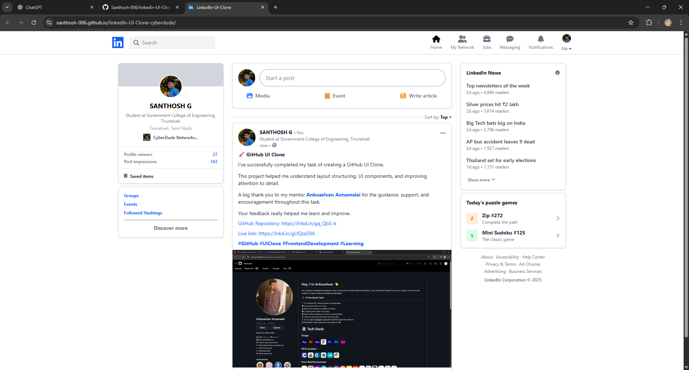

# LinkedIn UI Clone 💼

A responsive **LinkedIn UI Clone** created using **HTML** and **Tailwind CSS**.  
This project replicates the core layout and design of LinkedIn’s interface to practice modern UI development and responsive design.

---

## 🚀 Live Demo

🔗 **Live Link:**  
[Click here to view the project](https://santhosh-006.github.io/linkedIn-UI-Clone-cyberdude/)

---

## 📸 Output Preview

---

## 🛠️ Built With

- **HTML5**
- **Tailwind CSS**
- **Responsive Design**
- **Flexbox & Grid**

---

## ✨ Features

- LinkedIn-style top navigation bar
- Profile and feed layout
- Responsive design for mobile, tablet, and desktop
- Clean and modern UI
- Utility-first CSS approach

---
